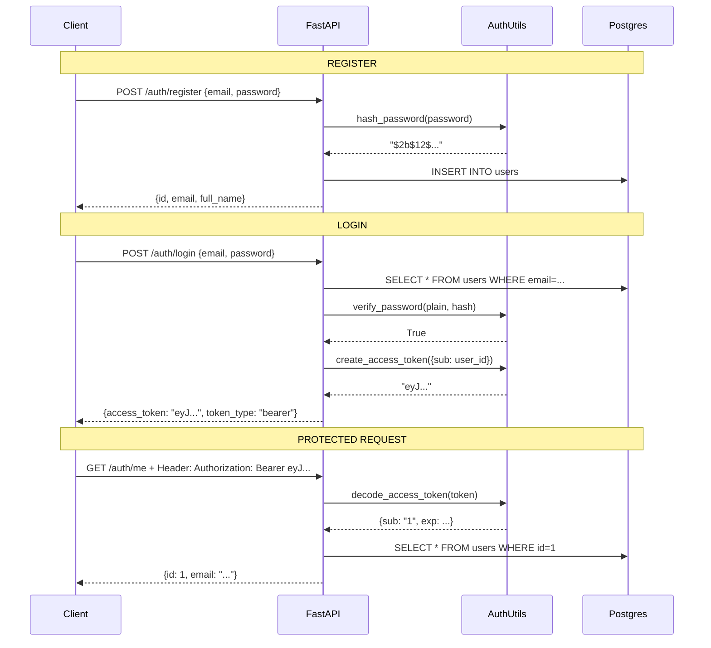

# JWT Auth System — How It All Works

## Install these first
```bash
pip install python-jose[cryptography] passlib[bcrypt] python-multipart email-validator
```

Add to your `.env`:
```
SECRET_KEY=some-long-random-string-change-this
```

---

## File Structure

```
app/
  auth/
    __init__.py        ← exports router + get_current_user
    utils.py           ← password hashing + JWT creation/decoding
    schemas.py         ← request/response shapes (Pydantic)
    dependencies.py    ← get_current_user (route guard)
    router.py          ← /auth/register, /auth/login, /auth/me
  models/
    user.py            ← User DB table
  db/
    database.py        ← engine, SessionLocal, get_db
  main.py              ← app assembly, includes auth router
```

---

## System Design: How Auth Works End-to-End

### The Big Picture



---

## Component Breakdown

### 1. `utils.py` — The Security Engine
Two jobs: hash passwords, create/verify JWTs.

**Password hashing with bcrypt:**
- bcrypt is one-way — you can't reverse it back to the original
- It's intentionally slow (making brute-force attacks expensive)
- Every hash is unique even for the same password (random salt)

```
"password123" → bcrypt → "$2b$12$eW5yH..." (stored in DB)
```

**JWT structure:**
```
eyJhbGciOiJIUzI1NiJ9   ← Header (base64): algorithm info
.eyJzdWIiOiIxIn0       ← Payload (base64): {sub: "1", exp: timestamp}
.SflKxwRJSMeKKF2QT4fw  ← Signature: HMAC(header+payload, SECRET_KEY)
```
The payload is readable by anyone — don't put sensitive data in it.
The signature is what proves nobody tampered with it.

---

### 2. `schemas.py` — Request/Response Contracts
Pydantic models that define what the API accepts and returns.

| Schema | Direction | Purpose |
|--------|-----------|---------|
| `RegisterRequest` | IN | email + password + optional name |
| `LoginRequest` | IN | email + password |
| `TokenResponse` | OUT | the JWT token |
| `UserResponse` | OUT | safe user object (no password hash) |

Key design choice: `UserResponse` never includes `hashed_password`.

---

### 3. `dependencies.py` — The Route Guard
`get_current_user` is a FastAPI dependency. Inject it into any route to protect it:

```python
@app.get("/tasks")
def get_tasks(current_user: User = Depends(get_current_user)):
    # Only reaches here if token is valid
    return current_user.tasks
```

It runs this check on every protected request:
```
Token present? → Signature valid? → Not expired? → User exists in DB? → ✅
      ↓                ↓                 ↓                ↓
     401              401              401              401
```

---

### 4. `router.py` — The Three Routes

| Route | Method | Auth Required | What it does |
|-------|--------|--------------|--------------|
| `/auth/register` | POST | No | Create account, returns user |
| `/auth/login` | POST | No | Verify credentials, returns JWT |
| `/auth/me` | GET | Yes | Returns current user profile |

**Security decisions baked in:**
- Register checks for duplicate emails before creating
- Login returns the same error for wrong email OR wrong password (prevents user enumeration)
- `/auth/me` is how you test your token works

---

## How to Test It

Run the server then open `http://localhost:8000/docs` — Swagger UI lets you test all routes visually.

**Step 1 — Register:**
```
POST /auth/register
{"email": "you@example.com", "password": "test1234"}
```

**Step 2 — Login:**
```
POST /auth/login
{"email": "you@example.com", "password": "test1234"}
→ copy the access_token from the response
```

**Step 3 — Test protected route:**
In Swagger, click "Authorize" (top right) and paste your token.
Then call `GET /auth/me` — you should get your user back.

---

## Trade-offs of This Design

| Decision | Benefit | Limitation |
|----------|---------|------------|
| Stateless JWT | No DB lookup per request, scales horizontally | Can't invalidate tokens before expiry |
| 30 min expiry | Limits damage if token is stolen | Users need to re-login frequently |
| bcrypt hashing | Industry standard, slow by design | Slightly slower registration |
| Generic login error | Prevents user enumeration | Harder to debug during development |

**Future improvements (Phase 2):**
- Refresh tokens (longer-lived, used to get new access tokens)
- Redis token blocklist (enables true logout)
- Email verification on register
- Rate limiting on login (prevents brute force) done this