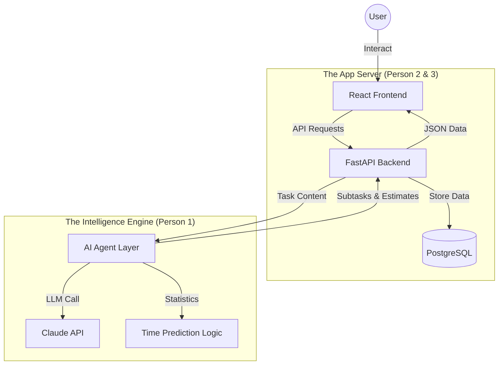

# Calibrate: System Architecture Overview

Even though Calibrate looks like a standard website, it operates as an **Intelligent Agent System**. Here is how the three layers work together to "check your reality."

## 🏗️ The 3-Layer Stack

## 🔄 The Life Cycle of a Task

1.  **Input (Frontend)**: You type *"Prepare Q4 presentation"* into the website.
2.  **Dispatch (Backend)**: The website sends this to the Python backend, which realizes this is a "High Complexity" task.
3.  **Breakdown (AI Engine)**: The backend asks the **AI Agent** to break it down. The agent uses an LLM (Claude) to identify that you need to:
    *   *Gather data (30m)*
    *   *Design slides (2h)*
    *   *Review period (1 day buffer)*
4.  **Reality Check (Backend)**: The backend looks at your **Google Calendar** (integrated by Person 2) and sees you have 4 hours of meetings today. It calculates: 
    *   `8h day - 4h meetings - 3h task = 1h buffer`.
5.  **Feedback (Frontend)**: The website immediately updates your **Capacity Gauge**. If the AI predicts you'll actually take 5 hours (not 3), it turns **Red** and suggests moving the task.

## 🧠 The "Agentic" Part: The Learning Loop

This isn't just a static todo list. It gets smarter over time:

*   **Step 1**: You finish the task and tell the website: *"Actually, that took 4 hours, not 3."*
*   **Step 2**: Person 3's backend saves this **Actual Time**.
*   **Step 3**: Person 1's learning script runs at night. It notices: *"This user always underestimates 'Presentation' tasks by 25%."*
*   **Step 4**: The next time you add a presentation, the website **automatically adds 25%** to the estimate before you even see it.

## 📱 How it feels to you
To you, it's just a fast, responsive mobile website. Under the hood, it's a constant conversation between your **Calendar**, your **History**, and the **AI** to make sure you're not burning yourself out.
